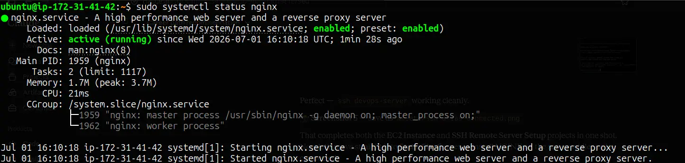
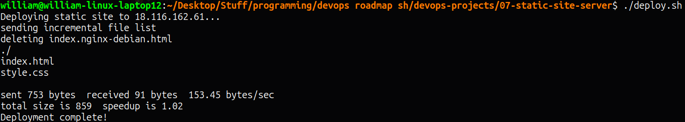

# Static Site Server

Setting up a remote Linux server on AWS EC2 and configuring NGINX to serve a static site, deployed via rsync.

## Project URL
https://roadmap.sh/projects/static-site-server

## Stack
- AWS EC2 (Ubuntu 24.04 LTS, t2.micro)
- NGINX
- rsync

## Steps

### 1. Launch EC2 instance
- Ubuntu 24.04 LTS, t2.micro
- Security group: ports 22, 80, 443 open

### 2. Install NGINX
```bash
sudo apt update
sudo apt install -y nginx
sudo systemctl start nginx
sudo systemctl enable nginx
```

### 3. Set permissions
```bash
sudo chown -R ubuntu:ubuntu /var/www/html
```

### 4. Deploy site locally using rsync
```bash
./deploy.sh
```

### deploy.sh
```bash
#!/bin/bash
SERVER_USER="ubuntu"
SERVER_IP="<your-ec2-ip>"
REMOTE_DIR="/var/www/html/"
LOCAL_DIR="./site/"
SSH_KEY="~/.ssh/devops-key.pem"

echo "Deploying static site to $SERVER_IP..."
rsync -avz --delete \
  -e "ssh -i $SSH_KEY" \
  $LOCAL_DIR \
  $SERVER_USER@$SERVER_IP:$REMOTE_DIR
echo "Deployment complete!"
```

## Screenshots

### NGINX Running


### NGINX Default Page


### rsync Deployment


### Site Live

