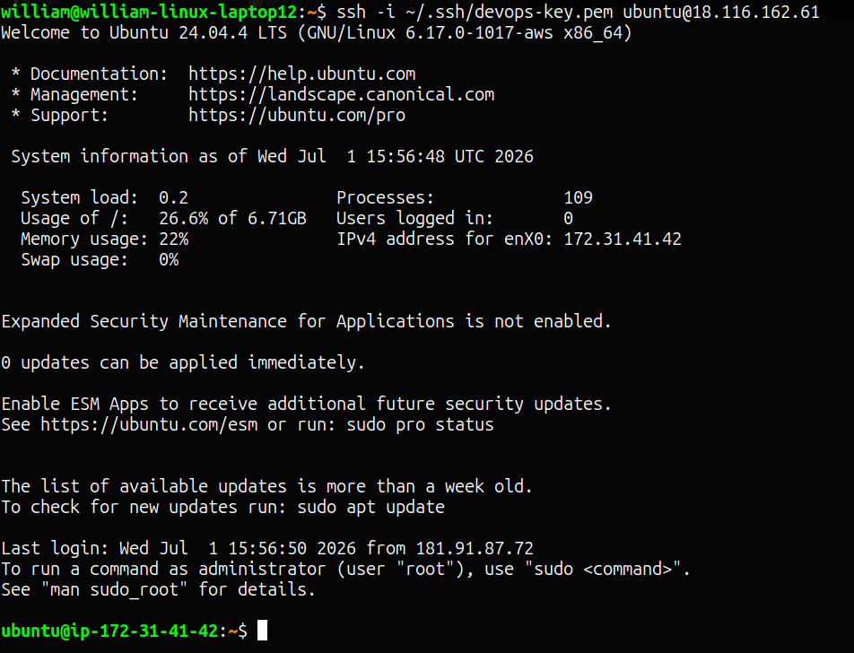
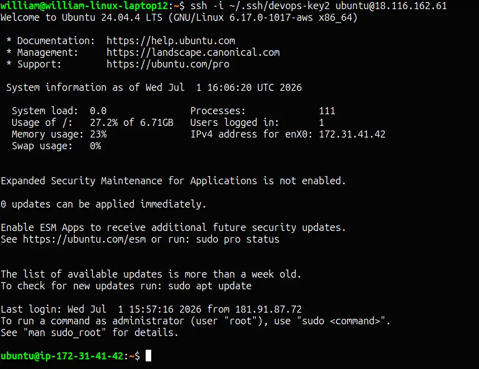
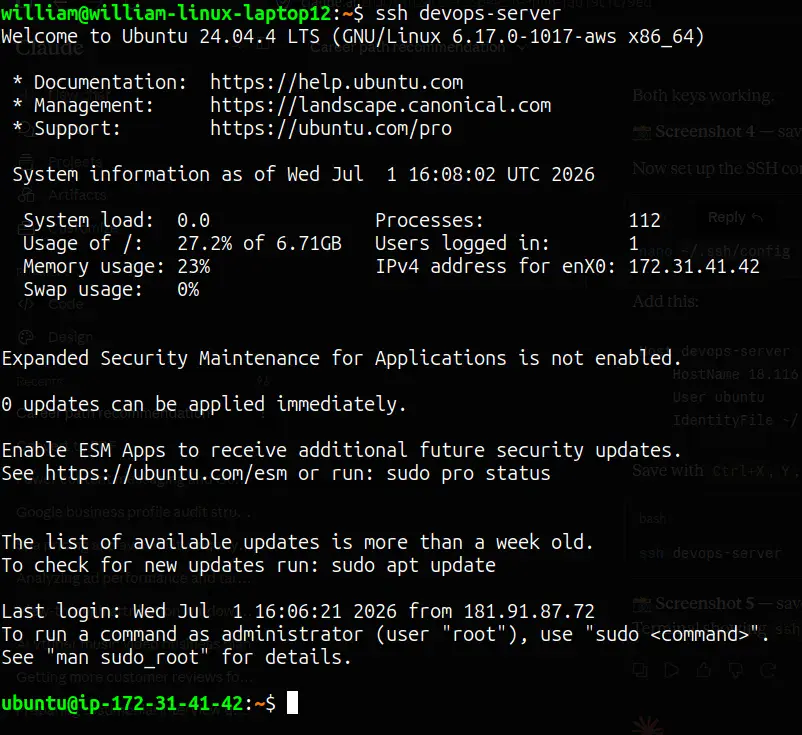

# SSH Remote Server Setup

Setting up a remote Linux server on AWS EC2 and configuring it to allow SSH connections using two separate key pairs and an SSH config alias.

## Project URL
https://roadmap.sh/projects/ssh-remote-server-setup

## Steps

### 1. Launch EC2 instance
- Ubuntu 24.04 LTS, t2.micro on AWS
- Security group: port 22 open

### 2. Connect with first key
```bash
ssh -i ~/.ssh/devops-key.pem ubuntu@<server-ip>
```

### 3. Generate second key pair locally
```bash
ssh-keygen -t ed25519 -f ~/.ssh/devops-key2 -C "devops second key"
```

### 4. Add second public key to server
```bash
echo "<contents-of-devops-key2.pub>" >> ~/.ssh/authorized_keys
```

### 5. Connect with second key
```bash
ssh -i ~/.ssh/devops-key2 ubuntu@<server-ip>
```

### 6. Set up SSH config alias
```
Host devops-server
    HostName <server-ip>
    User ubuntu
    IdentityFile ~/.ssh/devops-key.pem
```

### 7. Connect using alias
```bash
ssh devops-server
```

## Screenshots

### First SSH Connection


### Second Key Connection


### Alias Connection

