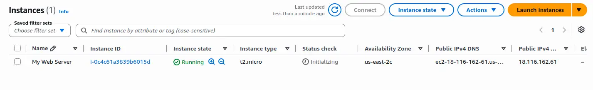
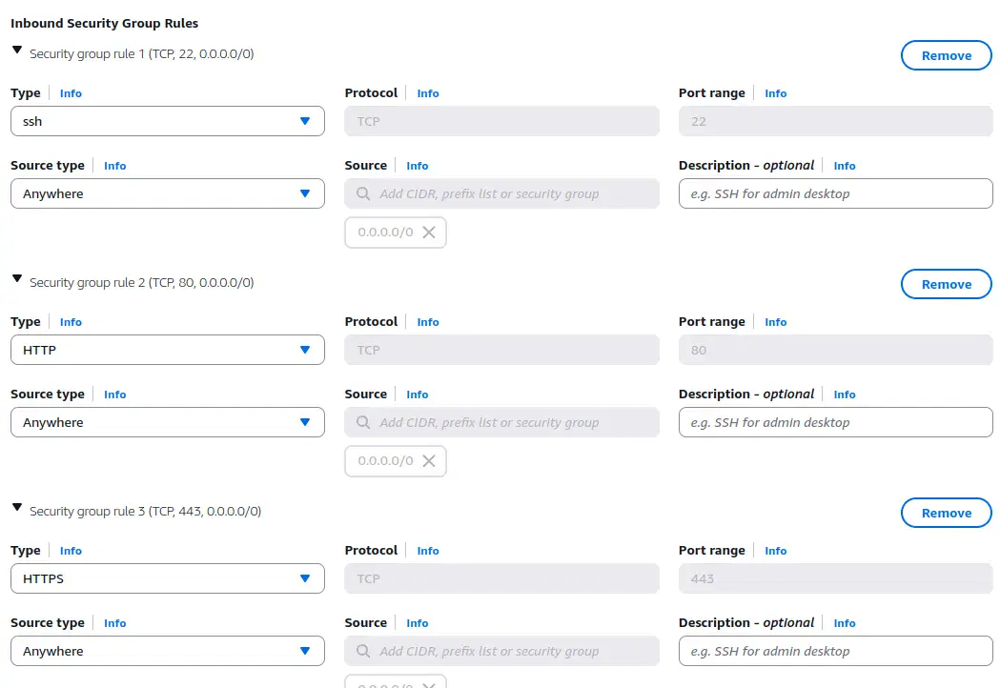
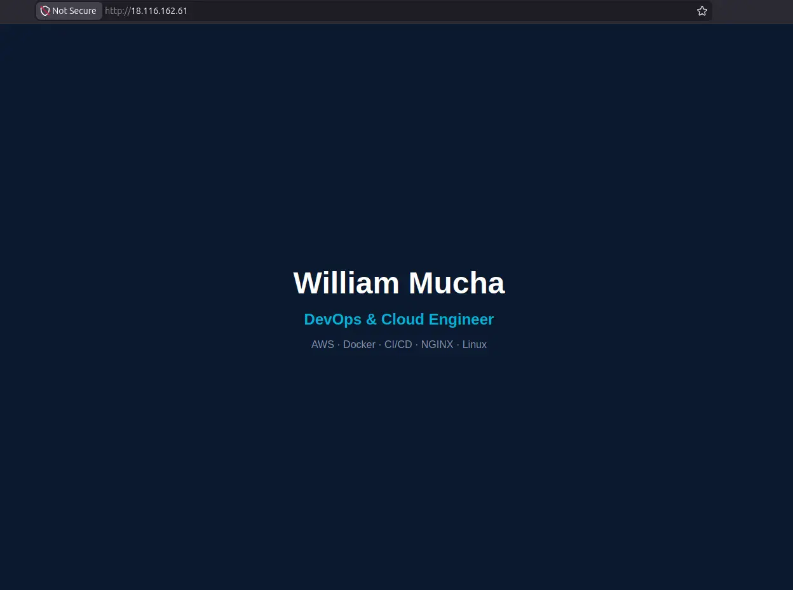

# EC2 Instance

Creating an AWS EC2 instance, configuring security groups, and deploying a static website served via NGINX.

## Project URL
https://roadmap.sh/projects/ec2-instance

## Specs
- AMI: Ubuntu Server 24.04 LTS
- Instance type: t2.micro
- Region: us-east-2

## Steps

### 1. Launch instance
- Ubuntu 24.04 LTS, t2.micro
- Security group inbound rules: SSH (22), HTTP (80), HTTPS (443)
- Auto-assign public IP enabled
- Created new key pair `devops-key`

### 2. Connect via SSH
```bash
chmod 400 ~/.ssh/devops-key.pem
ssh -i ~/.ssh/devops-key.pem ubuntu@<public-ip>
```

### 3. Update packages and install NGINX
```bash
sudo apt update
sudo apt install -y nginx
sudo systemctl start nginx
sudo systemctl enable nginx
```

### 4. Deploy static site
```bash
./deploy.sh
```

## Screenshots

### Instance Running


### Security Group


### SSH Connected


### Site Live

