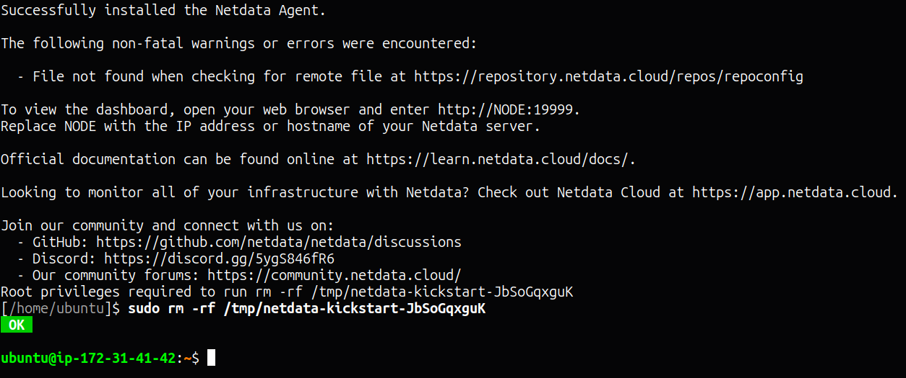
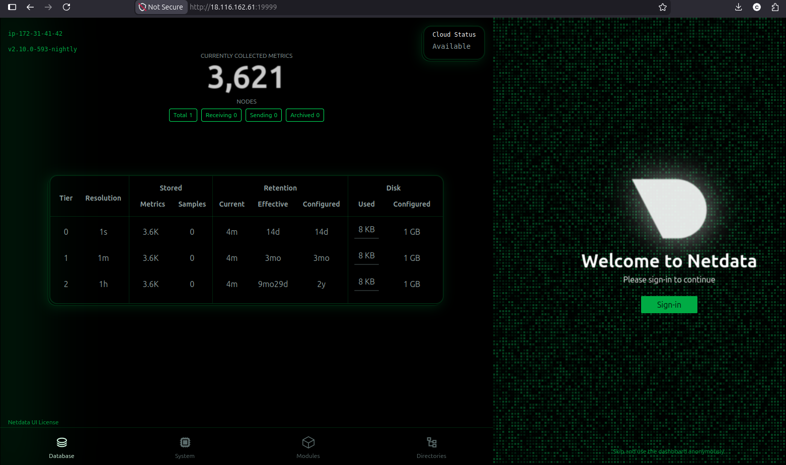
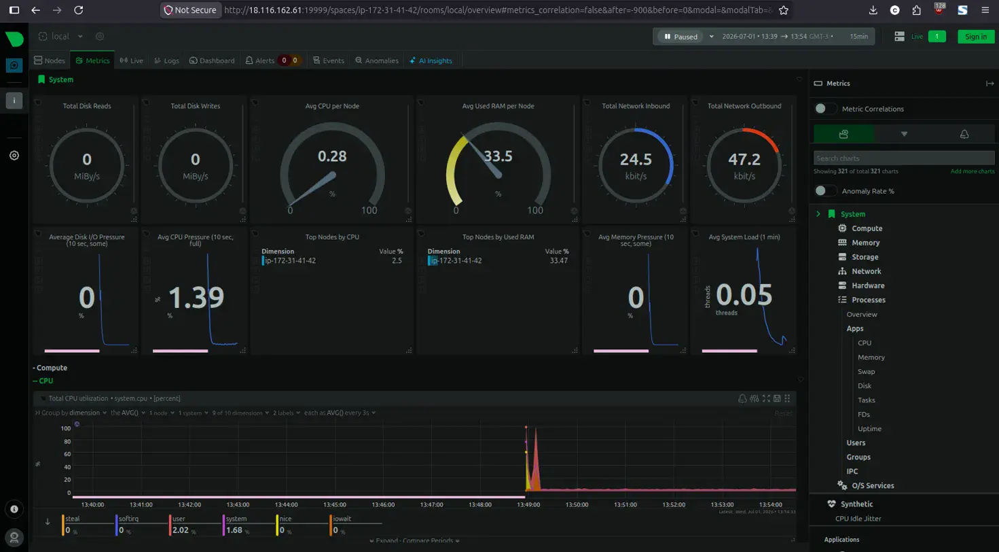
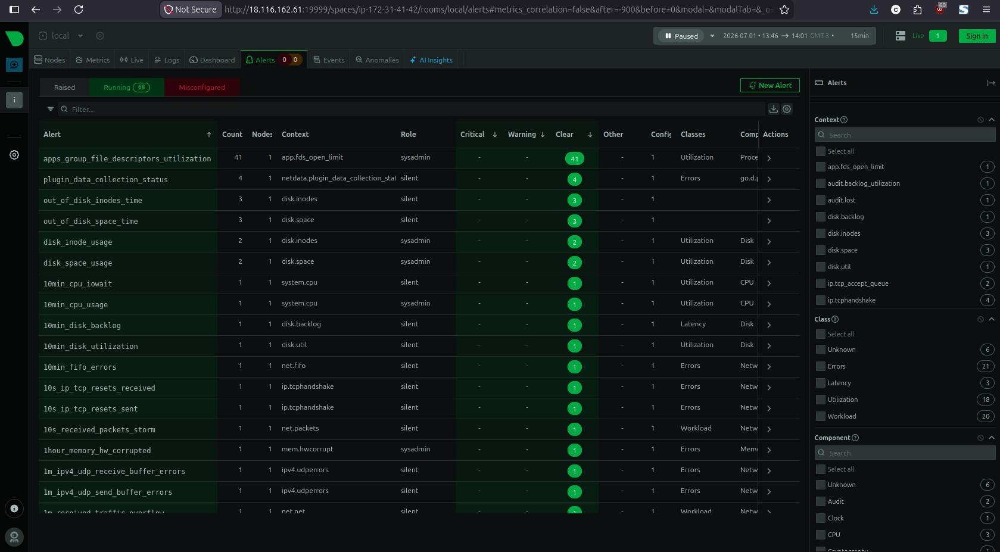
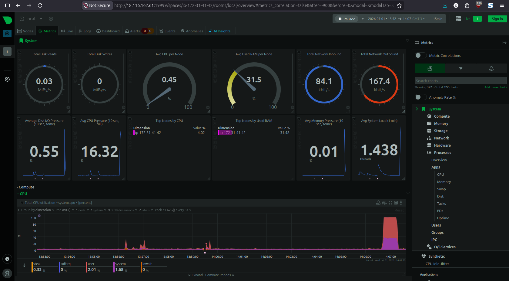

# Simple Monitoring

Setting up a basic monitoring dashboard using Netdata on an AWS EC2 instance, including automated setup, load testing, and cleanup scripts.

## Project URL
https://roadmap.sh/projects/simple-monitoring-dashboard

## Stack
- AWS EC2 (Ubuntu 24.04 LTS, t2.micro)
- Netdata v2.10.0

## Installation

### Manual install
```bash
wget -O /tmp/netdata-kickstart.sh https://get.netdata.cloud/kickstart.sh
sh /tmp/netdata-kickstart.sh
```

### Automated install using setup.sh
```bash
chmod +x setup.sh
sudo ./setup.sh
```

Access the dashboard at `http://<server-ip>:19999`

> Note: Make sure port 19999 is open in your server's security group/firewall.

## Scripts

### `setup.sh`
Automates the full Netdata installation on a fresh Linux server. Run this on any new Ubuntu server to get monitoring up in one command.

### `test_dashboard.sh`
Generates artificial CPU and disk load to stress test the server and visualize the metrics spike in the Netdata dashboard.
```bash
chmod +x test_dashboard.sh
sudo ./test_dashboard.sh
```
Watch the CPU utilization chart in the dashboard spike in real time during the test.

### `cleanup.sh`
Completely removes Netdata and all associated files from the server.
```bash
chmod +x cleanup.sh
sudo ./cleanup.sh
```

## Metrics Monitored
Netdata automatically monitors 3,621+ metrics out of the box including:
- CPU utilization
- Memory usage
- Disk I/O and space
- Network inbound/outbound
- Running processes
- System load average

## Alerts
Netdata comes with 68 pre-configured running alerts covering CPU, disk, memory, and network thresholds. Additionally a custom CPU alert was added at `/etc/netdata/health.d/cpu-alert.conf` to trigger warnings above 80% and critical above 95% CPU usage.

## Screenshots

### Netdata Installation


### Netdata Dashboard


### Live Metrics


### Running Alerts (68 active)


### Load Test CPU Spike

