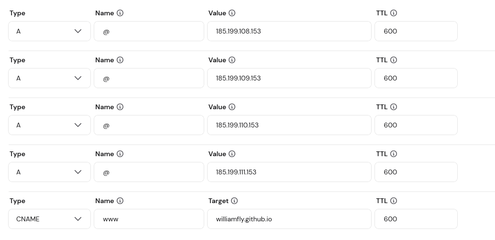
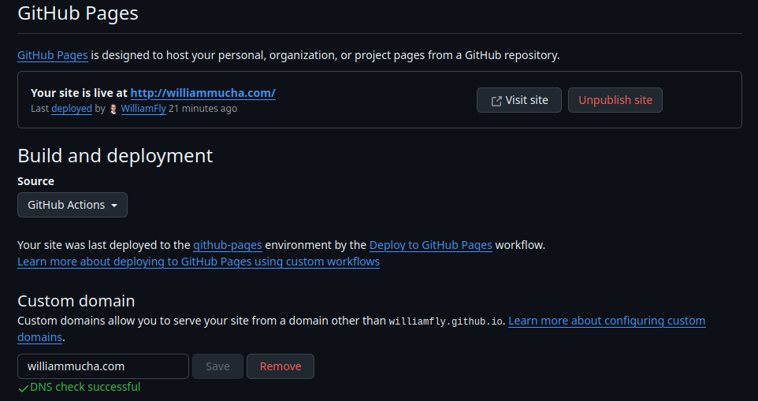

# Basic DNS Setup

Setting up a custom domain name for both GitHub Pages and a static site server, using Hostinger as the DNS provider for a domain registered on GoDaddy.

## Project URL
https://roadmap.sh/projects/basic-dns-setup

## Domain
`williammucha.com` — registered via GoDaddy, DNS managed via Hostinger

## Task 1 — Custom Domain for GitHub Pages

### Goal
Point `williammucha.com` to the GitHub Pages site at `williamfly.github.io/gh-deployment-workflow`.

### DNS Records added in Hostinger

| Type | Name | Value | TTL |
|------|------|-------|-----|
| A | @ | 185.199.108.153 | 600 |
| A | @ | 185.199.109.153 | 600 |
| A | @ | 185.199.110.153 | 600 |
| A | @ | 185.199.111.153 | 600 |
| CNAME | www | williamfly.github.io | 600 |

These 4 A records are GitHub Pages' official IP addresses. The CNAME points `www` to the GitHub Pages domain.

### Note on existing records
The domain previously had a Hostinger-managed AAAA record (`2a02:4780:9:1023:0:dcb:ddc6:2`) pointing to Hostinger's servers which was causing the site to route to Hostinger instead of GitHub Pages. This was removed to allow the GitHub Pages A records to take effect.

### GitHub Pages Configuration
- Navigated to repo Settings → Pages
- Set **Custom domain** to `williammucha.com`
- GitHub verified the DNS records and confirmed the domain

### Result
`williammucha.com` now serves the portfolio site deployed via GitHub Actions.

## Task 2 — Custom Domain for Static Site Server

The static site server project (07) used an AWS EC2 instance (`18.116.162.61`). The DNS configuration for the EC2 instance would follow the same pattern — an A record pointing `@` to the EC2 public IP. The instance has since been terminated as it was a practice environment.

## Screenshots

### Hostinger DNS Records

### GitHub Pages Custom Domain Verified

### Site Live at williammucha.com

