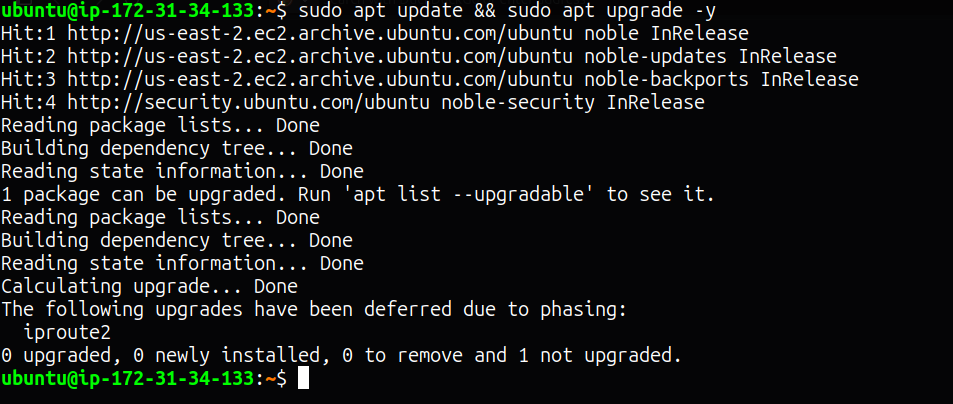
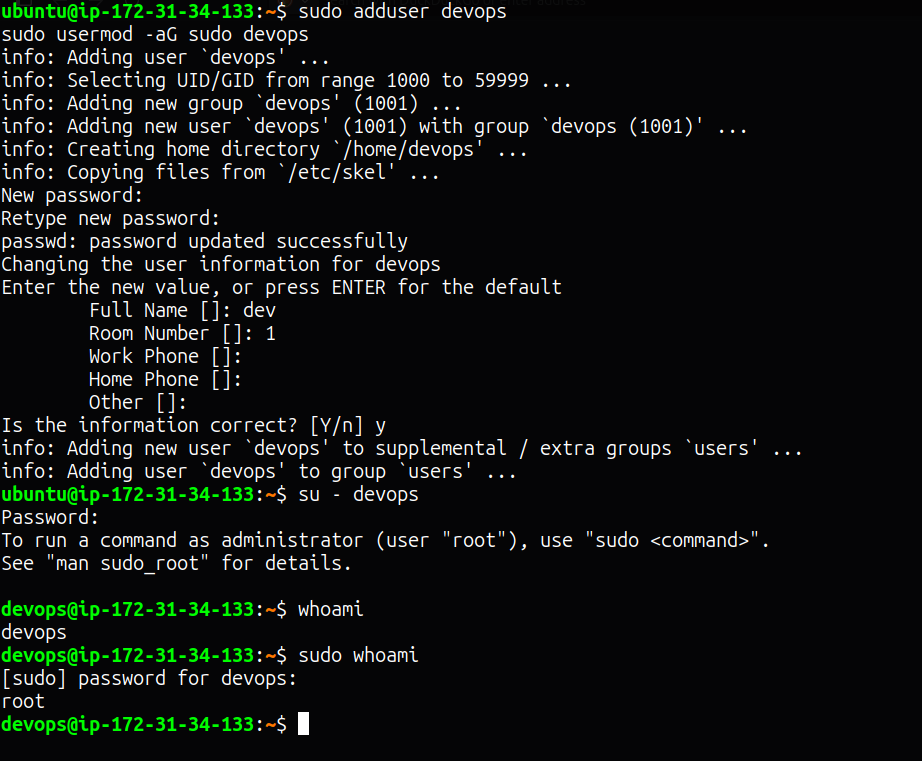
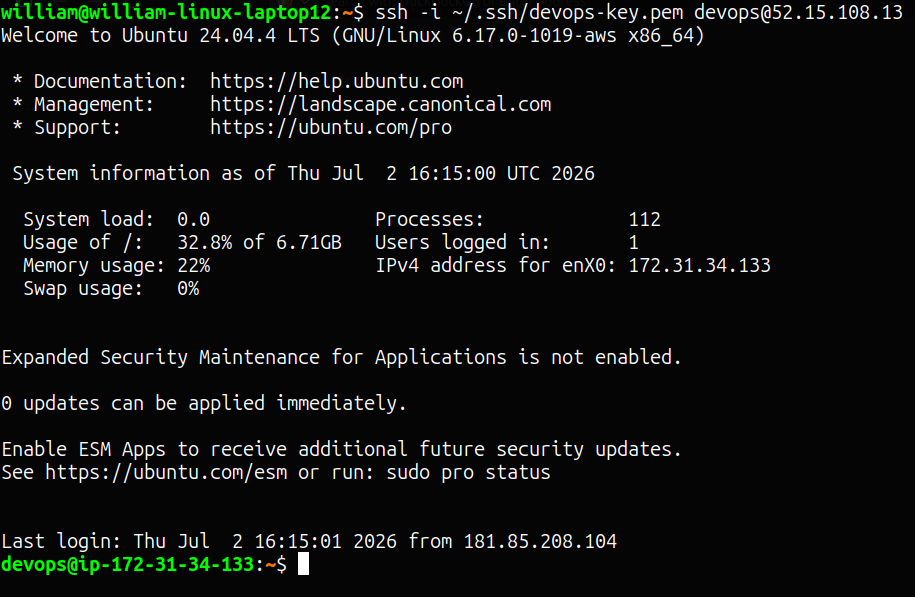
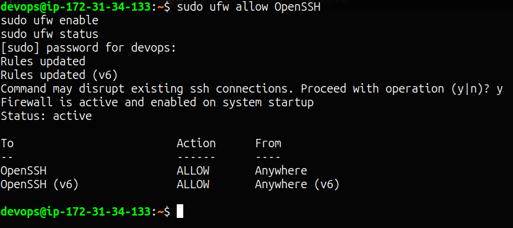
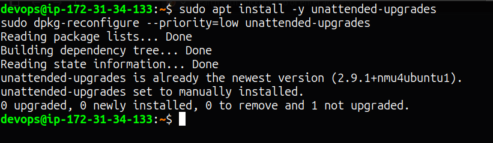
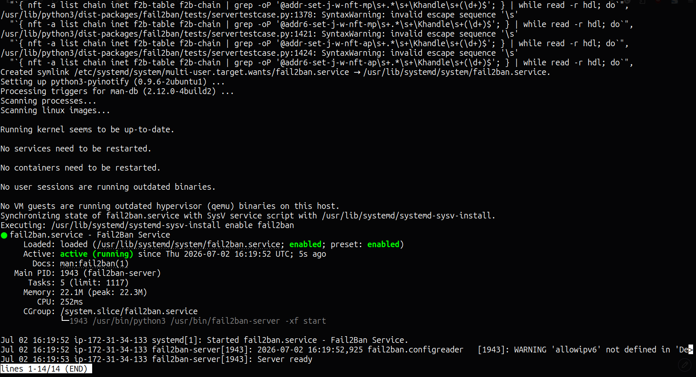
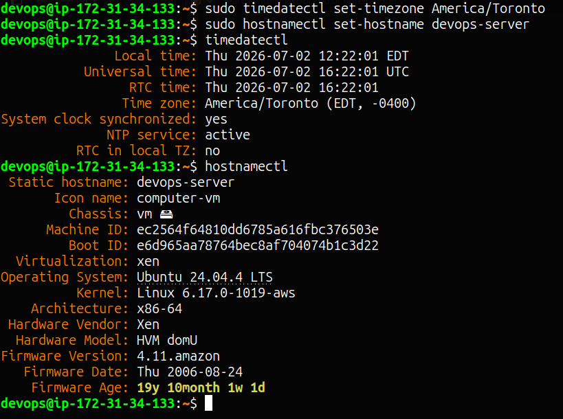
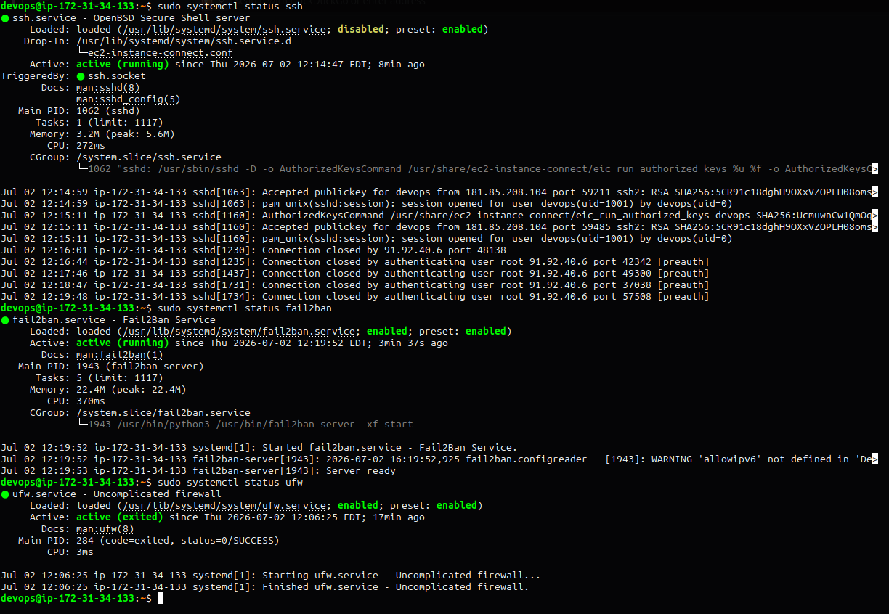
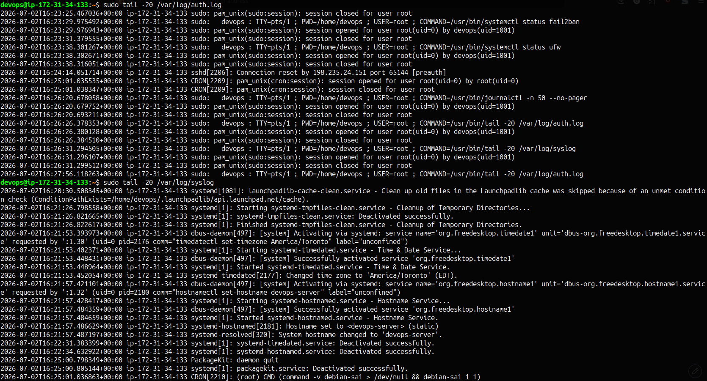
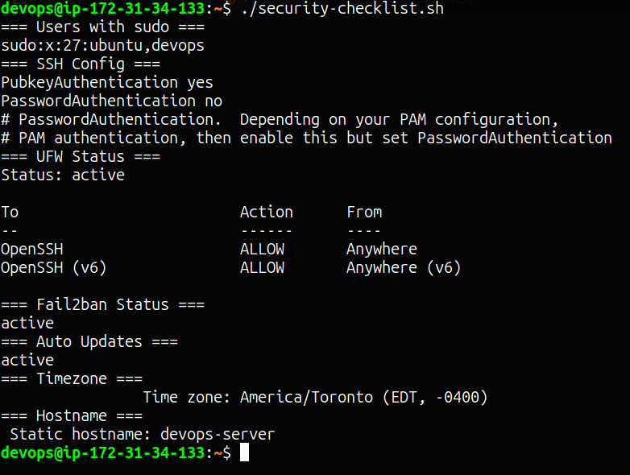

# Linux Server Setup

Setting up and securing a fresh Ubuntu 24.04 LTS server on AWS EC2 from scratch, covering user management, SSH hardening, firewall configuration, automatic updates, and brute-force protection.

## Project URL
https://roadmap.sh/projects/linux-server-setup

## Server
- Provider: AWS EC2
- AMI: Ubuntu 24.04.4 LTS
- Instance type: t2.micro
- Region: us-east-2

## Steps

### 1. System Updates
Updated all packages and rebooted to apply kernel upgrade.
```bash
sudo apt update && sudo apt upgrade -y
sudo reboot
```

### 2. Non-Root User Setup
Created a `devops` user with sudo privileges for all future administration.
```bash
sudo adduser devops
sudo usermod -aG sudo devops
```

### 3. SSH Hardening
Copied SSH keys to the devops user and disabled password-based authentication.
```bash
sudo mkdir -p /home/devops/.ssh
sudo cp ~/.ssh/authorized_keys /home/devops/.ssh/
sudo chown -R devops:devops /home/devops/.ssh
sudo chmod 700 /home/devops/.ssh
sudo chmod 600 /home/devops/.ssh/authorized_keys
```

Edited `/etc/ssh/sshd_config`:
```
PasswordAuthentication no
PubkeyAuthentication yes
```

```bash
sudo systemctl restart ssh
```

### 4. Firewall Configuration (UFW)
Configured UFW to allow only SSH by default.
```bash
sudo ufw allow OpenSSH
sudo ufw enable
sudo ufw status
```

### 5. Automatic Security Updates
Installed and enabled unattended-upgrades for automatic security patches.
```bash
sudo apt install -y unattended-upgrades
sudo dpkg-reconfigure --priority=low unattended-upgrades
```

### 6. Fail2Ban
Installed and enabled Fail2Ban to protect against brute-force SSH attacks.
```bash
sudo apt install -y fail2ban
sudo systemctl enable fail2ban
sudo systemctl start fail2ban
```

### 7. Timezone & Hostname
```bash
sudo timedatectl set-timezone America/Toronto
sudo hostnamectl set-hostname devops-server
```

### 8. Service Management
```bash
sudo systemctl status ssh
sudo systemctl status fail2ban
sudo systemctl status ufw
```

### 9. Log Inspection
```bash
sudo journalctl -n 50 --no-pager
sudo tail -20 /var/log/auth.log
sudo tail -20 /var/log/syslog
```

### 10. Security Checklist
```bash
echo "=== Users with sudo ===" && getent group sudo
echo "=== SSH Config ===" && sudo grep -E "PasswordAuthentication|PubkeyAuthentication" /etc/ssh/sshd_config
echo "=== UFW Status ===" && sudo ufw status
echo "=== Fail2ban Status ===" && sudo systemctl is-active fail2ban
echo "=== Auto Updates ===" && sudo systemctl is-active unattended-upgrades
echo "=== Timezone ===" && timedatectl | grep "Time zone"
echo "=== Hostname ===" && hostnamectl | grep "Static hostname"
```

## Security Checklist Results
| Check | Status |
|-------|--------|
| Non-root sudo user | ✅ devops |
| Password auth disabled | ✅ |
| Key-based auth enabled | ✅ |
| UFW active | ✅ SSH only |
| Fail2Ban active | ✅ |
| Auto updates active | ✅ |
| Timezone set | ✅ America/Toronto |
| Hostname set | ✅ devops-server |

## Screenshots

### System Update


### Non-Root User Created


### SSH Hardening


### UFW Firewall


### Automatic Updates


### Fail2Ban


### Timezone & Hostname


### Service Management


### Log Inspection


### Security Checklist

