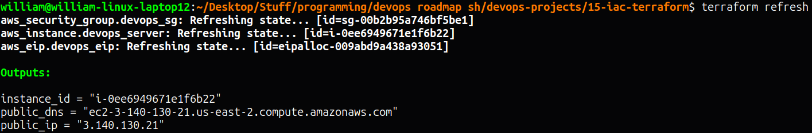
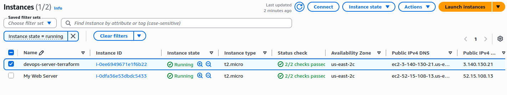
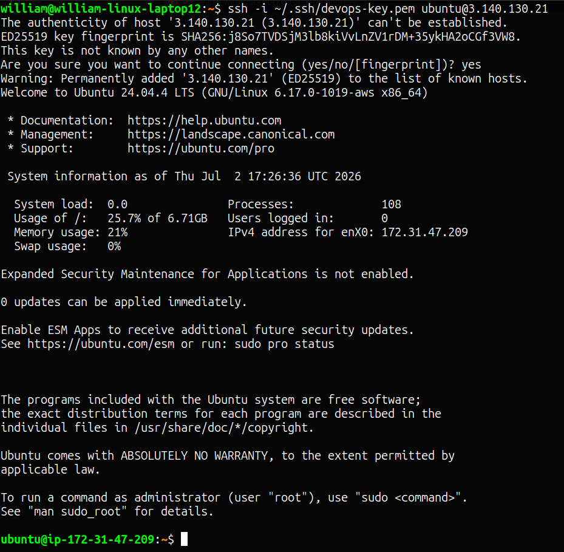

# IaC on AWS with Terraform

Using Terraform to provision an AWS EC2 instance with a security group and Elastic IP — infrastructure as code adapted from the roadmap.sh DigitalOcean project to AWS.

## Project URL
https://roadmap.sh/projects/iac-digitalocean

## Stack
- Terraform v1.9.8
- AWS Provider v5.100.0
- AWS EC2 (Ubuntu 24.04 LTS, t2.micro, us-east-2)

## Files
- `main.tf` — EC2 instance, security group, and Elastic IP resources
- `variables.tf` — configurable variables (region, AMI, instance type, key pair)
- `outputs.tf` — instance ID, public IP, and public DNS outputs

## Resources Created
| Resource | Name | Details |
|----------|------|---------|
| EC2 Instance | devops-server-terraform | t2.micro, Ubuntu 24.04 LTS |
| Security Group | devops-sg | SSH (22), HTTP (80), HTTPS (443) |
| Elastic IP | devops-eip | Static public IP attached to instance |

## Usage

### Prerequisites
- Terraform installed
- AWS CLI configured with IAM credentials (`aws configure`)
- Existing EC2 key pair named `devops-key`

### Commands
```bash
# Initialize Terraform and download AWS provider
terraform init

# Preview what will be created
terraform plan

# Create the infrastructure
terraform apply

# View outputs (public IP, instance ID, DNS)
terraform output

# Destroy all resources when done
terraform destroy
```

## Terraform Plan Output
```
Terraform used the selected providers to generate the following execution plan. Resource actions are indicated with the following symbols:
  + create

Terraform will perform the following actions:

  # aws_eip.devops_eip will be created
  + resource "aws_eip" "devops_eip" {
      + allocation_id        = (known after apply)
      + arn                  = (known after apply)
      + association_id       = (known after apply)
      + carrier_ip           = (known after apply)
      + customer_owned_ip    = (known after apply)
      + domain               = "vpc"
      + id                   = (known after apply)
      + instance             = (known after apply)
      + ipam_pool_id         = (known after apply)
      + network_border_group = (known after apply)
      + network_interface    = (known after apply)
      + private_dns          = (known after apply)
      + private_ip           = (known after apply)
      + ptr_record           = (known after apply)
      + public_dns           = (known after apply)
      + public_ip            = (known after apply)
      + public_ipv4_pool     = (known after apply)
      + tags                 = {
          + "Name" = "devops-eip"
        }
      + tags_all             = {
          + "Name" = "devops-eip"
        }
      + vpc                  = (known after apply)
    }

  # aws_instance.devops_server will be created
  + resource "aws_instance" "devops_server" {
      + ami                                  = "ami-0933f4f9e0a0fc3a5"
      + arn                                  = (known after apply)
      + associate_public_ip_address          = (known after apply)
      + availability_zone                    = (known after apply)
      + cpu_core_count                       = (known after apply)
      + cpu_threads_per_core                 = (known after apply)
      + disable_api_stop                     = (known after apply)
      + disable_api_termination              = (known after apply)
      + ebs_optimized                        = (known after apply)
      + enable_primary_ipv6                  = (known after apply)
      + get_password_data                    = false
      + host_id                              = (known after apply)
      + host_resource_group_arn              = (known after apply)
      + iam_instance_profile                 = (known after apply)
      + id                                   = (known after apply)
      + instance_initiated_shutdown_behavior = (known after apply)
      + instance_lifecycle                   = (known after apply)
      + instance_state                       = (known after apply)
      + instance_type                        = "t2.micro"
      + ipv6_address_count                   = (known after apply)
      + ipv6_addresses                       = (known after apply)
      + key_name                             = "devops-key"
      + monitoring                           = (known after apply)
      + outpost_arn                          = (known after apply)
      + password_data                        = (known after apply)
      + placement_group                      = (known after apply)
      + placement_partition_number           = (known after apply)
      + primary_network_interface_id         = (known after apply)
      + private_dns                          = (known after apply)
      + private_ip                           = (known after apply)
      + public_dns                           = (known after apply)
      + public_ip                            = (known after apply)
      + secondary_private_ips                = (known after apply)
      + security_groups                      = (known after apply)
      + source_dest_check                    = true
      + spot_instance_request_id             = (known after apply)
      + subnet_id                            = (known after apply)
      + tags                                 = {
          + "Environment" = "practice"
          + "Name"        = "devops-server-terraform"
          + "Project"     = "roadmap-devops"
        }
      + tags_all                             = {
          + "Environment" = "practice"
          + "Name"        = "devops-server-terraform"
          + "Project"     = "roadmap-devops"
        }
      + tenancy                              = (known after apply)
      + user_data                            = (known after apply)
      + user_data_base64                     = (known after apply)
      + user_data_replace_on_change          = false
      + vpc_security_group_ids               = (known after apply)

      + capacity_reservation_specification (known after apply)

      + cpu_options (known after apply)

      + ebs_block_device (known after apply)

      + enclave_options (known after apply)

      + ephemeral_block_device (known after apply)

      + instance_market_options (known after apply)

      + maintenance_options (known after apply)

      + metadata_options (known after apply)

      + network_interface (known after apply)

      + private_dns_name_options (known after apply)

      + root_block_device (known after apply)
    }

  # aws_security_group.devops_sg will be created
  + resource "aws_security_group" "devops_sg" {
      + arn                    = (known after apply)
      + description            = "Security group for DevOps practice server"
      + egress                 = [
          + {
              + cidr_blocks      = [
                  + "0.0.0.0/0",
                ]
              + from_port        = 0
              + ipv6_cidr_blocks = []
              + prefix_list_ids  = []
              + protocol         = "-1"
              + security_groups  = []
              + self             = false
              + to_port          = 0
                # (1 unchanged attribute hidden)
            },
        ]
      + id                     = (known after apply)
      + ingress                = [
          + {
              + cidr_blocks      = [
                  + "0.0.0.0/0",
                ]
              + description      = "HTTP"
              + from_port        = 80
              + ipv6_cidr_blocks = []
              + prefix_list_ids  = []
              + protocol         = "tcp"
              + security_groups  = []
              + self             = false
              + to_port          = 80
            },
          + {
              + cidr_blocks      = [
                  + "0.0.0.0/0",
                ]
              + description      = "HTTPS"
              + from_port        = 443
              + ipv6_cidr_blocks = []
              + prefix_list_ids  = []
              + protocol         = "tcp"
              + security_groups  = []
              + self             = false
              + to_port          = 443
            },
          + {
              + cidr_blocks      = [
                  + "0.0.0.0/0",
                ]
              + description      = "SSH"
              + from_port        = 22
              + ipv6_cidr_blocks = []
              + prefix_list_ids  = []
              + protocol         = "tcp"
              + security_groups  = []
              + self             = false
              + to_port          = 22
            },
        ]
      + name                   = "devops-sg"
      + name_prefix            = (known after apply)
      + owner_id               = (known after apply)
      + revoke_rules_on_delete = false
      + tags                   = {
          + "Name" = "devops-sg"
        }
      + tags_all               = {
          + "Name" = "devops-sg"
        }
      + vpc_id                 = (known after apply)
    }

Plan: 3 to add, 0 to change, 0 to destroy.
```

## Terraform Apply Output
```
aws_security_group.devops_sg: Creating...
aws_security_group.devops_sg: Creation complete after 5s [id=sg-00b2b95a746bf5be1]
aws_instance.devops_server: Creating...
aws_instance.devops_server: Creation complete after 16s [id=i-0ee6949671e1f6b22]
aws_eip.devops_eip: Creating...
aws_eip.devops_eip: Creation complete after 3s [id=eipalloc-009abd9a438a93051]

Apply complete! Resources: 3 added, 0 changed, 0 destroyed.
```

## Terraform Outputs
```
instance_id = "i-0ee6949671e1f6b22"
public_dns  = "ec2-3-140-130-21.us-east-2.compute.amazonaws.com"
public_ip   = "3.140.130.21"
```

## Screenshots

### Terraform Outputs


### EC2 Instances Running


### SSH Connection to Terraform-Provisioned Instance

