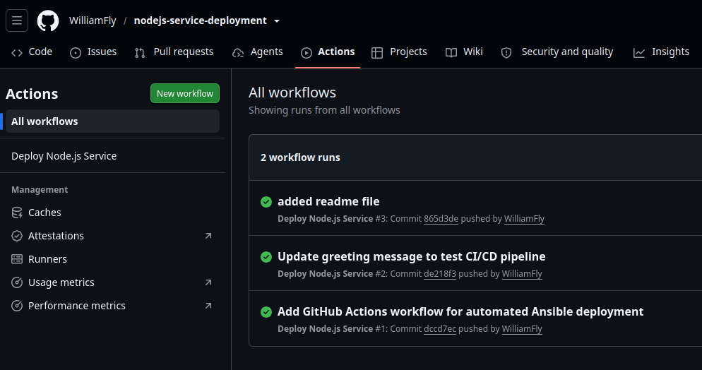
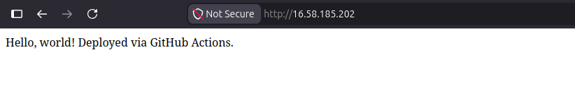

# Node.js Service Deployment (CI/CD)

Provisioning an AWS EC2 instance with Terraform, configuring it with Ansible, and automating deployment of a Node.js service via GitHub Actions — a full CI/CD pipeline from infrastructure to running application.

## Project URL
https://roadmap.sh/projects/nodejs-service-deployment

## Stack
- Terraform v1.9.8 — provisions the EC2 instance, security group, and Elastic IP
- Ansible-core v2.16.3 — installs Node.js/npm and deploys the app as a systemd service
- GitHub Actions — automates deployment on every push to the app repo's `main` branch
- App source lives in a separate repo: [nodejs-service-deployment](https://github.com/WilliamFly/nodejs-service-deployment)

## Architecture

```
Push to app repo (main)
        │
        ▼
GitHub Actions workflow triggers
        │
        ├── Checkout app repo
        ├── Checkout this repo (Ansible playbook)
        ├── Install Ansible on runner
        ├── Build inventory.ini from Secrets (SERVER_IP, SSH_PRIVATE_KEY)
        │
        ▼
ansible-playbook node_service.yml --tags app
        │
        ▼
Server: clone app repo → npm install → restart systemd service
        │
        ▼
App live on port 80
```

## Roles

| Role | Purpose |
|------|---------|
| `base` | Updates packages, installs core utilities |
| `nodejs` | Installs Node.js 20.x and npm via NodeSource |
| `app` | Clones the app repo, installs dependencies, deploys as a systemd service (`nodeapp.service`) bound to port 80 |

## Usage

### Prerequisites
- Terraform + AWS CLI configured
- Ansible installed
- SSH key pair with server access

### Provision the server
```bash
terraform init
terraform apply
```

### Manual full deployment (first-time setup)
```bash
ansible-playbook node_service.yml -i inventory.ini
```

### Manual redeploy (app only — same command CI runs)
```bash
ansible-playbook node_service.yml -i inventory.ini --tags app
```

### Automated deployment
Push any change to the `main` branch of the [nodejs-service-deployment](https://github.com/WilliamFly/nodejs-service-deployment) repo — the GitHub Actions workflow there handles the rest.

## Notes
- `inventory.ini` is gitignored and regenerated dynamically both locally and in CI — since the server's IP changes whenever it's recreated via Terraform, committing it would go stale.
- The Node.js app runs as `root` via systemd to bind port 80 directly (ports below 1024 require elevated privileges). A more production-appropriate pattern would run the app as a non-root user on a higher port (e.g. 3000) behind an NGINX reverse proxy — a good next iteration.
- CI/CD currently reuses the primary `devops-key` for SSH. A dedicated, narrowly-scoped deploy key would be a better real-world practice for separating CI access from personal infrastructure access.

## Screenshots

### GitHub Actions — Successful Automated Deployment


### Live Endpoint — Deployed via CI/CD

