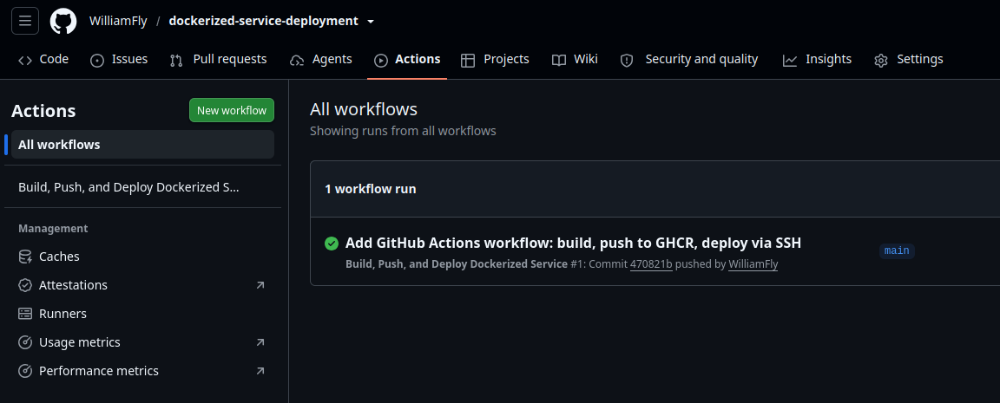
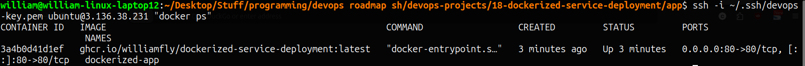

# Dockerized Service Deployment (CI/CD)

Provisioning an AWS EC2 instance with Terraform, installing Docker via Ansible, and using GitHub Actions to build, push, and deploy a containerized Node.js service — with secrets management for both deployment credentials and application secrets.

## Project URL
https://roadmap.sh/projects/dockerized-service-deployment

## Stack
- Terraform v1.9.8 — provisions the EC2 instance, security group, and Elastic IP
- Ansible-core v2.16.3 — installs Docker Engine on the server
- Docker + GitHub Container Registry (GHCR)
- GitHub Actions — builds, pushes, and deploys on every push to `main`
- App source lives in a separate repo: [dockerized-service-deployment](https://github.com/WilliamFly/dockerized-service-deployment)

## Architecture

```
Push to app repo (main)
        │
        ▼
GitHub Actions: build-and-push job
        │
        ├── Build Docker image from Dockerfile
        ├── Log in to GHCR (using built-in GITHUB_TOKEN)
        └── Push image → ghcr.io/williamfly/dockerized-service-deployment:latest
        │
        ▼
GitHub Actions: deploy job
        │
        └── SSH into remote server
                ├── docker login ghcr.io
                ├── docker pull latest image
                ├── stop/remove old container
                └── docker run new container (secrets injected as env vars)
```

## Roles

| Role | Purpose |
|------|---------|
| `base` | Updates packages, installs core utilities |
| `docker` | Installs Docker Engine (official apt repo), enables the service, adds `ubuntu` user to the `docker` group |

## Usage

### Prerequisites
- Terraform + AWS CLI configured
- Ansible installed
- SSH key pair with server access

### Provision the server
```bash
terraform init
terraform apply
```

### Configure the server (install Docker)
```bash
ansible-playbook server_setup.yml -i inventory.ini
```

### Deployment
Handled entirely by GitHub Actions in the [dockerized-service-deployment](https://github.com/WilliamFly/dockerized-service-deployment) repo — push to `main` and the pipeline builds, pushes, and redeploys automatically.

## Notes
- Unlike Project 17 (which installed Node.js directly on the host), this project only needs Docker on the server — the application and its dependencies are fully self-contained in the image.
- `.env` values never touch the image itself; they're injected at container runtime, both locally (`--env-file`) and in production (`-e` flags built from GitHub Secrets).
- `inventory.ini` is gitignored, same reasoning as Project 17 — the server IP changes if the instance is ever recreated, so committing it would go stale.
- GHCR packages default to private visibility; the server authenticates via `docker login` before pulling, using the same `GITHUB_TOKEN` mechanism as the build step.

## Screenshots

### GitHub Actions — Successful Build, Push, and Deploy


### Deployed Container Running on Server

