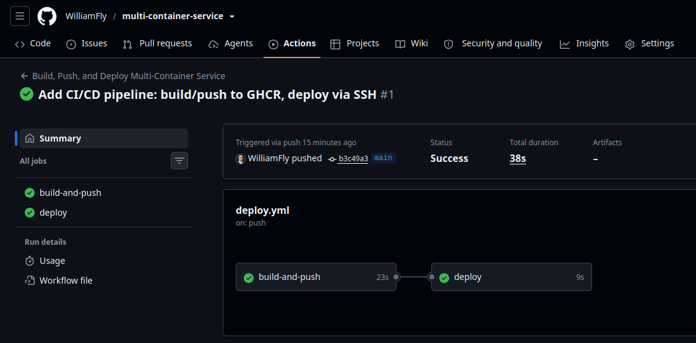
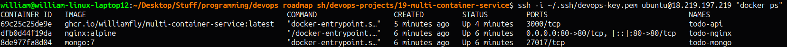

# Multi-Container Application (Docker Compose)

Provisioning an AWS EC2 instance with Terraform, installing Docker + Docker Compose via Ansible, and deploying a multi-container Todo API (Node.js + MongoDB + NGINX reverse proxy) through a GitHub Actions CI/CD pipeline.

## Project URL
https://roadmap.sh/projects/multi-container-service

## Stack
- Terraform v1.9.8 — provisions the EC2 instance, security group, and Elastic IP
- Ansible-core v2.16.3 — installs Docker Engine + Compose plugin, deploys the app
- Docker Compose — orchestrates `mongo`, `api`, and `nginx` containers
- GitHub Container Registry (GHCR) + GitHub Actions
- App source lives in a separate repo: [multi-container-service](https://github.com/WilliamFly/multi-container-service)

## Roles

| Role | Purpose |
|------|---------|
| `base` | Updates packages, installs core utilities |
| `docker` | Installs Docker Engine and the Compose plugin, adds `ubuntu` to the `docker` group |
| `app` | Clones the app repo, deploys production `.env`, runs `docker compose up` — all as the `ubuntu` user, not root |

## Architecture

```
Push to app repo (main)
        │
        ▼
GitHub Actions: build-and-push
        ├── Build image from Dockerfile
        └── Push to ghcr.io/williamfly/multi-container-service
        │
        ▼
GitHub Actions: deploy (SSH as ubuntu)
        ├── git pull (compose/nginx config changes)
        ├── docker compose pull (fresh image)
        └── docker compose up -d (no rebuild on server)
```

Inside the server, three containers share an internal Docker network:
- `mongo` — internal only, data persisted via named volume
- `api` — internal only, reachable at `api:3000`
- `nginx` — the only container exposing a port (80), reverse-proxying to `api:3000`

## Usage

### Provision the server
```bash
terraform init
terraform apply
```

### Configure and deploy (first-time setup)
```bash
ansible-playbook server_setup.yml -i inventory.ini
```

### Redeploy app only
```bash
ansible-playbook server_setup.yml -i inventory.ini --tags app
```

### Automated deployment
Push to `main` on the [multi-container-service](https://github.com/WilliamFly/multi-container-service) repo — GitHub Actions handles build, push, and deploy automatically.

## Notes

- **Ownership matters for CI/CD, not just Ansible runs.** The `app` role originally cloned the repo using `become: true` (root), while the GitHub Actions deploy step SSHs in as `ubuntu`. This meant `git pull` in the CI workflow silently failed due to permission errors, and the deploy step kept running the *stale* `docker-compose.yml` without any error surfacing — the container just quietly kept using an old locally-built image instead of the GHCR-pushed one. Fixed by using `become_user: ubuntu` for all app-directory operations in the role, so ownership is correct from the very first provisioning run, not patched after the fact.
- **Build once, deploy the same artifact everywhere.** The production server never runs `docker compose up --build` — only `pull` + `up -d`. This guarantees the exact image tested/built in CI is what's running in production, rather than risking a different build result on the server.
- `mongo` and `api` intentionally have no `ports:` mapping in `docker-compose.yml` — only `nginx` is reachable from outside the Docker network, reducing attack surface compared to exposing the API or database directly.
- `inventory.ini` is gitignored — regenerated per-instance since the IP changes if the server is recreated.
- **Next-project idea:** build a reusable Ansible role (or fold into `base`) that establishes correct user/directory ownership *before* any app-specific role runs — applying the Project 14 "harden first" philosophy to every future project automatically, rather than fixing ownership issues reactively per project.

## Screenshots

### GitHub Actions — Successful Build, Push, and Deploy


### Running Containers on Server (mongo, api, nginx)

