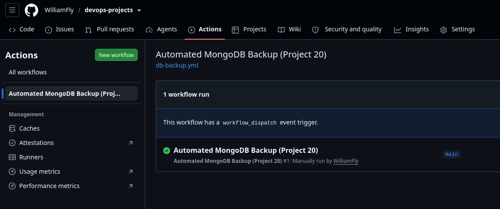
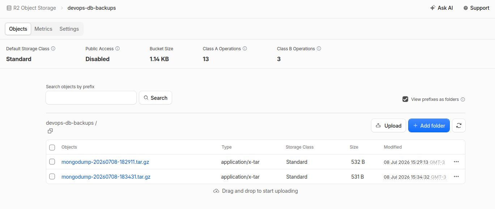

# Automated DB Backups

Automated MongoDB backups running every 12 hours via a GitHub Actions scheduled workflow, uploading tarballs to Cloudflare R2. Includes a tested restore script proving actual disaster recovery, not just backup creation. Also introduces a one-command `deploy.sh` wrapper that fully provisions and configures the server — Terraform apply → wait for SSH → Ansible run — with zero manual steps.

## Project URL
https://roadmap.sh/projects/automated-backups

## Stack
- Terraform v1.9.8 — provisions the EC2 instance and security group (SSH only, no public-facing service needed)
- Ansible-core v2.16.3 — installs Docker, runs a MongoDB container, seeds sample data, deploys backup/restore scripts
- Docker — MongoDB runs containerized, matching a production-realistic setup
- Cloudflare R2 — S3-API-compatible object storage for backup tarballs (zero egress fees)
- GitHub Actions — scheduled workflow (`cron: '0 */12 * * *'`) triggers the backup via SSH

## Architecture

```
GitHub Actions (schedule, every 12h, or manual dispatch)
        │
        ▼
SSH into server
        │
        ▼
/opt/db-backup/backup.sh
        ├── mongodump (inside container)
        ├── docker cp (pull dump out of container)
        ├── tar czf (compress)
        └── aws s3 cp --endpoint-url <R2 endpoint> --region auto
                │
                ▼
        Cloudflare R2 bucket
```

Restore path (manual, or scriptable):
```
/opt/db-backup/restore.sh
        ├── aws s3 ls (find latest backup by filename sort)
        ├── aws s3 cp (download)
        ├── tar xzf (extract)
        ├── docker cp (into container)
        └── mongorestore --drop (replace current data with backup)
```

## Roles

| Role | Purpose |
|------|---------|
| `base` | Updates packages, installs core utilities |
| `docker` | Installs Docker Engine + Compose plugin, adds `ubuntu` to `docker` group, resets the SSH connection so group membership takes effect immediately (see Notes) |
| `mongo` | Runs a MongoDB container with a persistent volume, seeds sample todo data |
| `backup` | Installs AWS CLI, deploys `backup.sh` and `restore.sh` (both Jinja2 templates, R2 credentials injected as Ansible extra vars — never hardcoded or committed) |

## One-Command Deployment

`deploy.sh` orchestrates the full lifecycle — Terraform provisioning, waiting for SSH to actually become available, then running Ansible — as a single command:

```bash
./deploy.sh
```

This solves the classic "handoff problem" between infrastructure provisioning and configuration management: rather than manually copying the new IP into `inventory.ini` after every `terraform apply`, the script captures it directly from Terraform's output, polls SSH until it responds, then hands off to Ansible automatically.

R2 credentials are stored locally in a gitignored `.env.deploy` file and sourced by the script — never committed, never hardcoded in Ansible files.

## Automated Backup — GitHub Actions

`.github/workflows/db-backup.yml` runs on a 12-hour schedule (`cron: '0 */12 * * *'`, UTC) and also supports manual triggering via `workflow_dispatch`. It SSHs into the server and simply runs `/opt/db-backup/backup.sh` — no R2 credentials are duplicated into GitHub Secrets, since the script is already correctly configured by Ansible on the server itself.

**Note:** this workflow is intentionally **disabled** in the repository once this project's server is destroyed, since a `schedule`-triggered workflow (unlike `push`-triggered ones) keeps firing indefinitely regardless of repo activity — it would otherwise fail every 12 hours trying to reach a server that no longer exists.

## Disaster Recovery — Tested

To prove this isn't just "a script that runs," a real deletion/restore cycle was tested:

1. Confirmed 3 seeded todos existed in MongoDB
2. Deliberately deleted all documents (`db.todos.deleteMany({})`) — simulating data loss
3. Ran `/opt/db-backup/restore.sh`, which found the latest backup in R2, downloaded it, and restored it with `mongorestore --drop`
4. Confirmed all 3 original documents were back, with matching `_id`s — a clean, exact restore

## Usage

```bash
# Full one-command provision + configure
./deploy.sh

# Manual backup
ssh -i ~/.ssh/devops-key.pem ubuntu@<ip> "/opt/db-backup/backup.sh"

# Manual restore (pulls latest backup from R2)
ssh -i ~/.ssh/devops-key.pem ubuntu@<ip> "/opt/db-backup/restore.sh"
```

## Notes

- **No reverse proxy needed.** Unlike Projects 17-19, this server has no user-facing HTTP service — it exists purely for internal data operations (`mongodump`/`mongorestore` over SSH). Only port 22 is open in the security group.
- **`docker` group membership requires a fresh SSH session to take effect.** Adding `ubuntu` to the `docker` group mid-playbook doesn't apply until the SSH connection is re-established — Ansible's `meta: reset_connection` solves this cleanly. This was a latent bug retroactively fixed in Project 19's `docker` role too, since it happened to work there only by accident of task ordering on an already-running server.
- **R2 requires `--region auto`**, not a real AWS region name — a very Cloudflare-specific quirk when reusing standard `aws s3` tooling against R2's S3-compatible API.
- **Local backups are cleaned up after each upload** — R2 is the single source of truth for backup history, not the server's disk, so backups don't accumulate and eventually fill storage.
- **Scheduled workflows need manual lifecycle management.** Unlike `push`-triggered workflows, a `schedule` trigger fires forever regardless of activity — it must be manually disabled before decommissioning the infrastructure it depends on.

## Stretch Goal — Complete
Restore script implemented and tested with a real delete/restore cycle (see above).

## Screenshots

### GitHub Actions — Successful Manual Backup Run


### Cloudflare R2 — Backup Tarballs Stored

