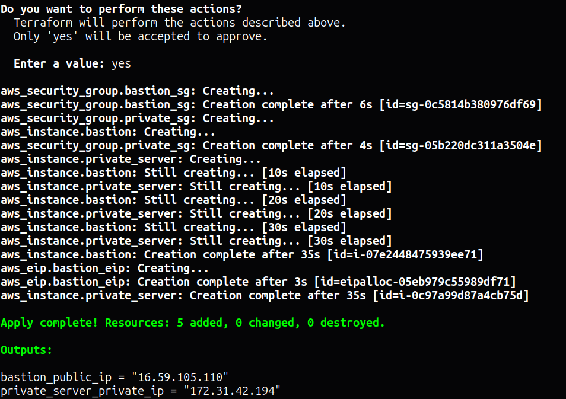
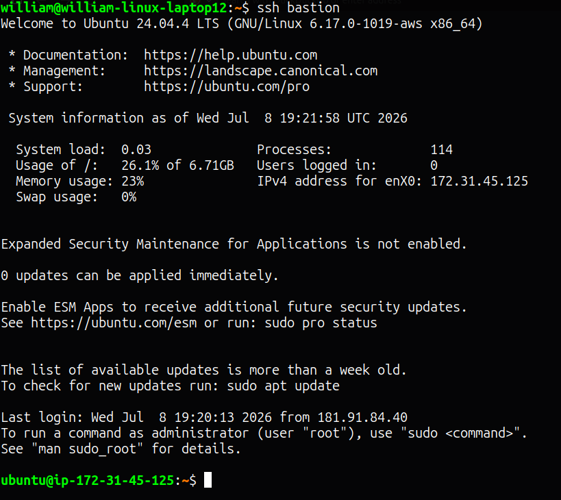
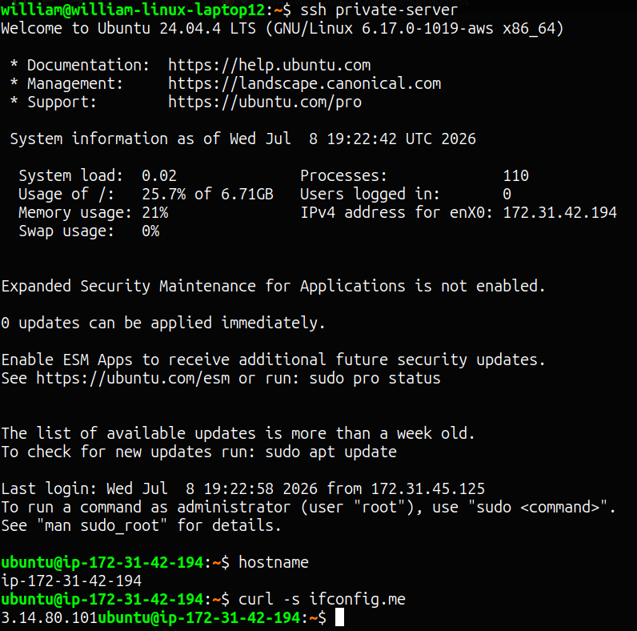
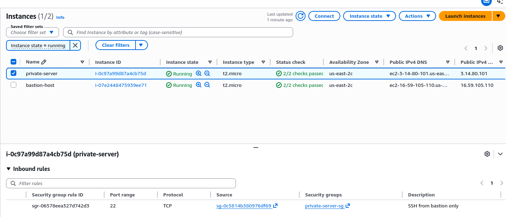
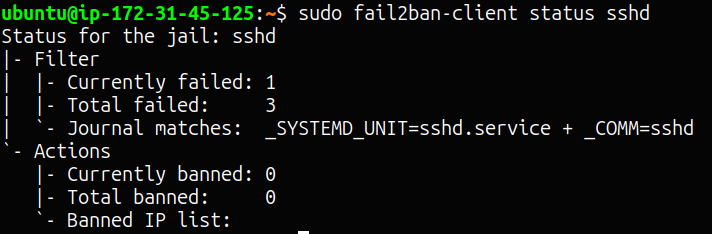

# Bastion Host

A secure gateway architecture: a publicly accessible bastion host that's the only entry point into the network, and a private server with no public IP at all — reachable only via SSH `ProxyJump` through the bastion. Fully automated with a single `deploy.sh` script (Terraform + Ansible), including fail2ban monitoring and iptables rate-limiting on the bastion.

## Project URL
https://roadmap.sh/projects/bastion-host

## Stack
- Terraform v1.9.8 — provisions both instances and their security groups
- Ansible-core v2.16.3 — configures both hosts, tunneling to the private server through the bastion automatically
- fail2ban — monitors and bans repeated failed SSH attempts
- iptables — kernel-level rate-limiting on new SSH connections

## Architecture

```
Internet
   │
   ▼
Bastion Host (public IP, SSH open, fail2ban + iptables)
   │
   │  ProxyJump (SSH tunnel)
   ▼
Private Server (no public IP, SSH only from bastion's security group)
```

- **Bastion security group**: allows SSH (22) from anywhere (0.0.0.0/0)
- **Private server security group**: allows SSH (22) **only** from the bastion's security group ID — not an IP, not a CIDR block, a direct reference to `aws_security_group.bastion_sg.id`. This means even if the private server's internal IP were somehow discovered, nothing outside the bastion's own security group could reach it.

## One-Command Deployment

```bash
./deploy.sh
```

This single script:
1. Runs `terraform apply`, provisioning both instances
2. Captures both IPs directly from Terraform's output (no manual copy-paste)
3. Writes `inventory.ini`, including a `ProxyCommand` entry so Ansible can reach the private server through the bastion automatically
4. Generates `ssh-config-snippet.txt` for your local `~/.ssh/config` (not auto-appended — see Notes)
5. Polls SSH on both the bastion and (via the bastion) the private server until both respond
6. Runs the full Ansible playbook against both hosts in one pass

## SSH Access

After running `deploy.sh`, append the generated snippet to your local SSH config:
```bash
cat ssh-config-snippet.txt >> ~/.ssh/config
```

Then:
```bash
ssh bastion           # direct connection to the public bastion
ssh private-server    # transparently tunnels through the bastion via ProxyJump
```

## Roles

| Role | Applies to | Purpose |
|------|-----------|---------|
| `base` | Both hosts | Updates packages, installs core utilities |
| `fail2ban` | Bastion only | Monitors and auto-bans repeated failed SSH login attempts |
| `iptables` | Bastion only | Rate-limits new SSH connections — max 4 per IP per 60 seconds, dropped at the firewall level before fail2ban even evaluates them |

## Verification

- **SSH jump works**: confirmed `ssh private-server` lands on a distinct machine from the bastion (different `hostname` and different outbound public IP via `curl ifconfig.me`)
- **fail2ban is active**: triggered several deliberate failed SSH attempts against the bastion; `fail2ban-client status sshd` showed `Total failed: 3`, confirming real-time tracking
- **iptables rules are live**: `iptables -L INPUT -v -n` shows both the `recent: SET` and `recent: UPDATE ... DROP` rules targeting port 22

## Notes

- **The private server genuinely has no public IP** (`associate_public_ip_address = false` in Terraform) — this isn't just a firewall rule doing the work, the instance has no route to/from the public internet at all.
- **`ssh-config-snippet.txt` is intentionally not auto-appended** to your real `~/.ssh/config` by `deploy.sh`. Automatically modifying a personal config file carries real risk (duplicate `Host` blocks, silently overwriting an existing entry) — safer to review and append manually.
- **Ansible reaches the private server via the same `ProxyJump` mechanism as the SSH config**, expressed through `ansible_ssh_common_args` with a `ProxyCommand` in `inventory.ini` — this means Ansible doesn't require your local SSH config to exist at all; it's fully self-contained.
- **Stretch goal (MFA) was intentionally skipped** in favor of iptables rate-limiting, which was judged to offer better practical security value for the setup/verification effort compared to configuring TOTP-based MFA for this practice environment.
- **This project fully achieves the "one script, full stack, repeatable in under a minute" goal** established in Project 20 — extended here to handle the added complexity of a two-host, ProxyJump-based topology.

## Screenshots

### Terraform Apply — Both Instances Provisioned


### SSH to Bastion


### SSH Jump to Private Server (proxied through bastion)


### AWS Console — Private Server Security Group (source = bastion SG, not an IP)


### fail2ban Tracking Failed SSH Attempts

