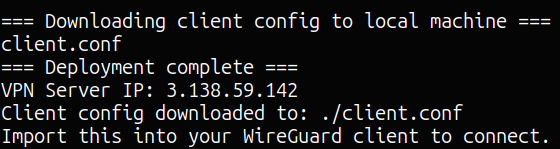
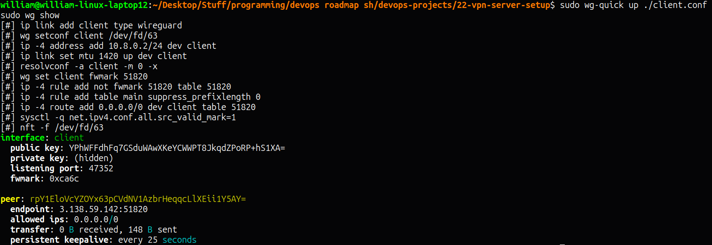
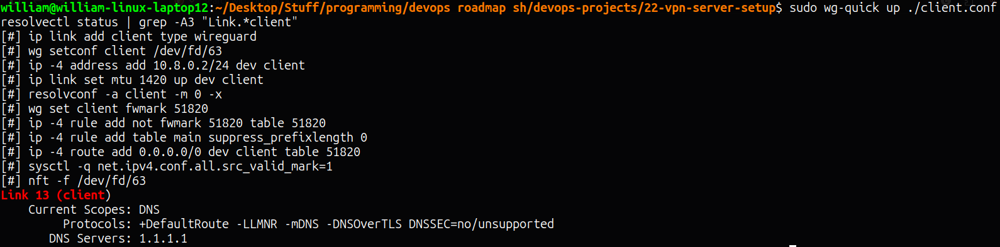

# VPN Server Setup (WireGuard)

A self-hosted WireGuard VPN server, fully automated with a single `deploy.sh` script (Terraform + Ansible). Encrypts all IPv4 traffic and DNS queries through a secure tunnel, verified with a real before/after IP comparison.

## Project URL
https://roadmap.sh/projects/vpn-server-setup

## Stack
- Terraform v1.9.8 — provisions the EC2 instance and security group (SSH + WireGuard UDP 51820)
- Ansible-core v2.16.3 — installs WireGuard, generates keys, configures the server, and produces a ready-to-use client config
- WireGuard — modern kernel-integrated VPN protocol

## Architecture

```
Laptop (client, 10.8.0.2)
     │
     │  Encrypted WireGuard tunnel (UDP 51820)
     ▼
VPN Server (10.8.0.1, public IP)
     │
     │  NAT/MASQUERADE
     ▼
Internet
```

- **Server**: `10.8.0.1/24` on the `wg0` interface, with `iptables` NAT rules (`MASQUERADE`) forwarding tunneled traffic out to the real internet
- **Client**: `10.8.0.2/24`, configured with `AllowedIPs = 0.0.0.0/0` for full-tunnel routing — all IPv4 traffic goes through the VPN, not just traffic to specific destinations

## One-Command Deployment

```bash
./deploy.sh
```

This single script:
1. Runs `terraform apply`, provisioning the server
2. Captures the public IP directly from Terraform's output
3. Writes `inventory.ini` automatically
4. Waits for SSH to become available
5. Runs the Ansible playbook — installs WireGuard, generates server + client key pairs, configures `wg0.conf`, enables IP forwarding and NAT
6. Downloads the generated `client.conf` directly to your local machine via `scp`

## Connecting

```bash
sudo apt install wireguard -y
sudo wg-quick up ./client.conf
sudo wg show
```

Disconnect with:
```bash
sudo wg-quick down ./client.conf
```

## Verification

**IP address changes when connected** (proof traffic is actually tunneling):
- Before connecting: `181.91.84.40` (local ISP IP)
- After connecting: `3.138.59.142` (VPN server's IP)

**DNS resolves through the VPN, not leaking to a local/ISP resolver:**
```bash
resolvectl status | grep -A3 "Link.*client"
```
Shows `Current DNS Server: 1.1.1.1` — matching the DNS configured in the client config, confirming no DNS leak.

**Active tunnel confirmed via `wg show`:**
- Successful handshake
- Real data transfer (bytes sent/received)
- Correct endpoint and allowed IPs

## Important Gotcha Discovered: IPv6 Leak

Initial testing with `curl ifconfig.me` (no flag) showed **no IP change at all** — which looked like a broken VPN, but wasn't. The WireGuard config only routes **IPv4** traffic (`ip -4 route add 0.0.0.0/0 ...`). This machine also has IPv6 connectivity, and `ifconfig.me` resolved over IPv6 by default — completely bypassing the tunnel, since nothing was configured to route IPv6 through the VPN.

This is a real, well-known category of VPN misconfiguration called an **IPv6 leak** — a VPN can look fully connected and "working" while a portion of your traffic quietly bypasses it entirely if IPv6 isn't explicitly handled. Forcing `curl -4` confirmed the tunnel was actually working correctly for IPv4 all along; the issue was purely in how the test was being performed, not the VPN itself.

**Real-world takeaway:** a production WireGuard setup handling both IPv4 and IPv6 traffic should either configure IPv6 routing through the tunnel as well, or explicitly disable IPv6 on the client while connected — otherwise IPv6 traffic silently leaks outside the VPN's protection.

## Notes

- **Idempotent key generation** — the Ansible role uses `creates:` guards and re-reads existing keys from disk on subsequent runs, so re-running `deploy.sh`/the playbook against an already-configured server won't regenerate keys and break existing client configs.
- **Single client, full-tunnel routing** — configured for one laptop client with `AllowedIPs = 0.0.0.0/0`. Split tunneling (routing only specific traffic through the VPN) was left as a documented stretch goal rather than implemented, to keep this project focused and quickly verifiable.
- **`client.conf` is downloaded automatically** by `deploy.sh` via `scp` — no manual retrieval step needed, consistent with the "one command, fully working result" goal from Projects 20/21.

## Screenshots

### Deployment Complete


### WireGuard Tunnel Connected


### Public IP Before Connecting


### Public IP After Connecting / Disconnecting


### DNS Resolution Through VPN (No Leak)

